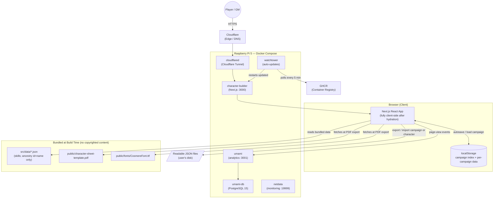
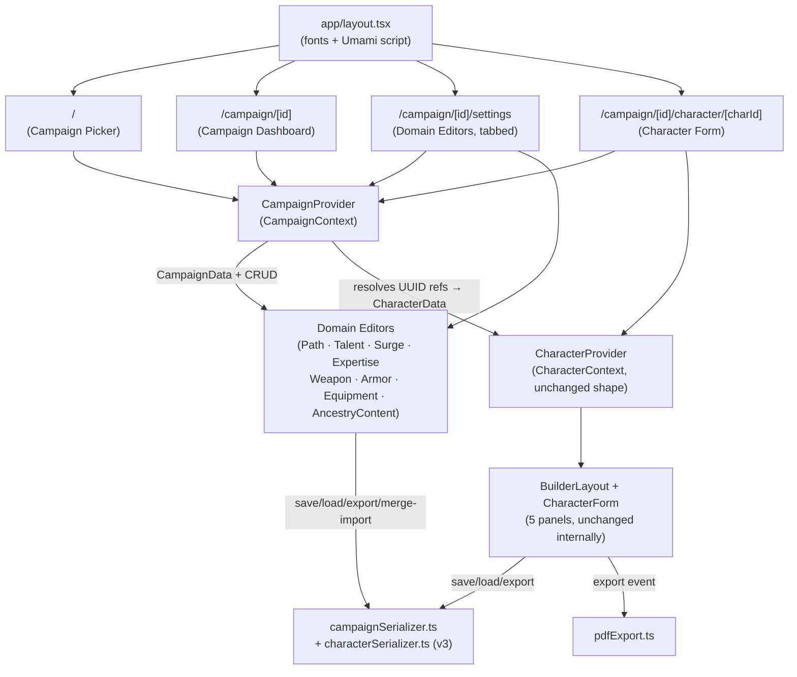
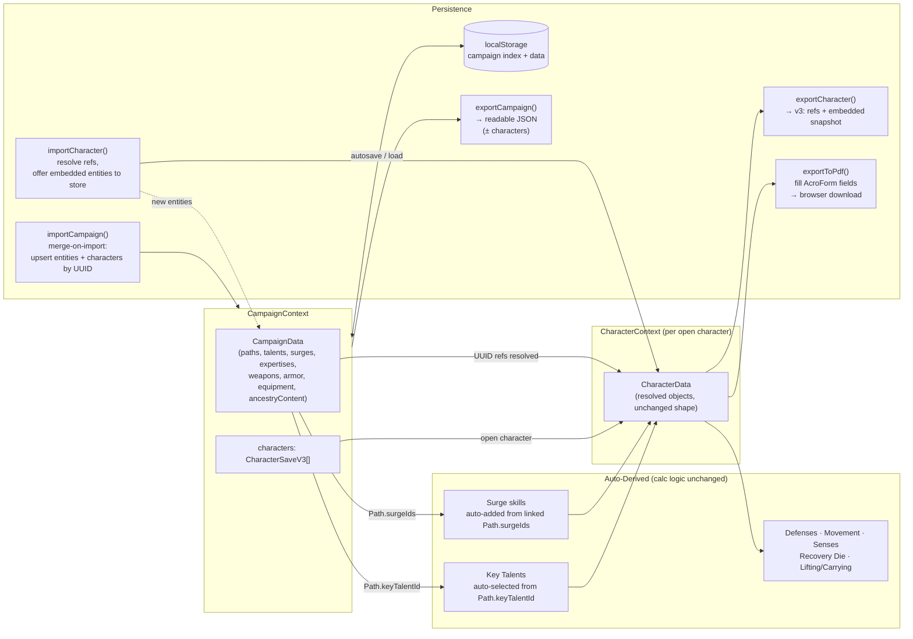
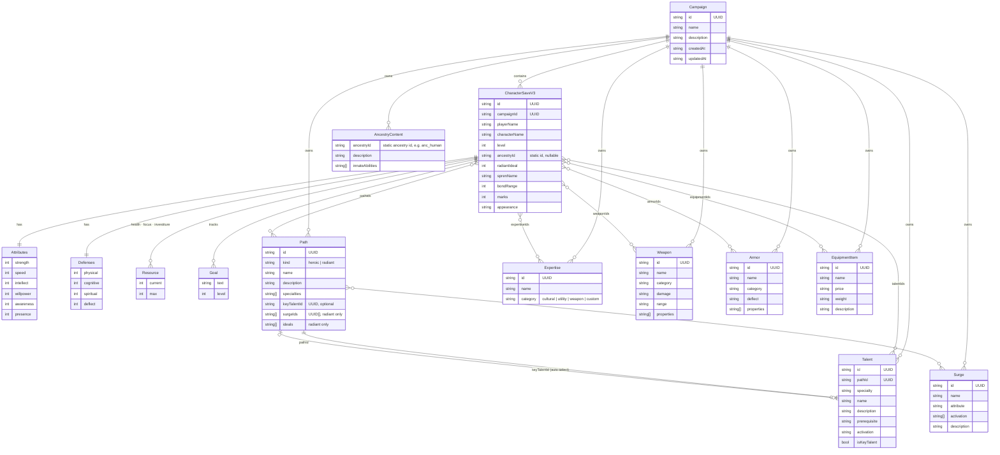

# Cosmere RPG Character Builder — Architecture Diagrams

> **Status: TARGET ARCHITECTURE — not yet implemented.**
> These diagrams describe the campaign-based re-architecture approved in
> [`../../consent.md`](../../consent.md) (2026-08-08), which serves as the
> PRD for this change. They replace the as-built diagrams from the
> 2026-07-25 scan (see changelog at the bottom for what changed and why).
> Until the phases in `consent.md` §6 are implemented, the *actual* running
> app still matches the single-character, single-page shape these diagrams
> describe as superseded.

---

## 1. System Architecture

*How the browser, app, static assets, and deployment infrastructure relate.*

No copyrighted game content (talents, paths, surges, expertises, weapons,
armor, equipment) is bundled at build time anymore — it lives in
user-created **Campaign** files, held in `localStorage` and exchanged as
readable JSON. Only mechanical/structural data (`skills.json`, and
`ancestries.json` stripped to `id` + `name`) stays bundled.

---

## 2. Component Hierarchy

*React component tree showing ownership and data flow. The app is now
strictly campaign-first and multi-route (`consent.md` §8 UI decision);
no character screen exists outside a loaded campaign.*

---

## 3. State & Data Flow

*How Campaign and Character state relate, how UUID-linked automation still
works once paths/talents/surges become campaign data, and how persistence
(localStorage + file export/import with merge-on-import) fits in.*

---

## 4. Domain Model

*Key entities and their relationships. `Campaign` is the new top-level
owner of all copyright-sensitive content (`consent.md` §3–4); everything
under it is user-entered and UUID-keyed. `Attributes`, `Defenses`,
`Resource`, and `Goal` stay embedded value objects on the character, just
as before — only their container is renamed `CharacterSaveV3`. `Ancestry`
(bundled `id`+`name` list, e.g. `anc_human`) and `Skill` (bundled, id-keyed)
remain static/code-level and are referenced by plain string id rather than
modeled as campaign entities — they carry no copyrighted prose.*

---

*Changelog*
- 2026-07-25: initial diagrams created from codebase scan (as-built, single-character app)
- 2026-08-08: replaced all four diagrams for the campaign-based re-architecture
  (see `../../consent.md`) — introduced `Campaign`/`CampaignData` as the owner
  of all copyright-sensitive content, multi-route UI, `CampaignContext`,
  localStorage + merge-on-import persistence, and unified `Path`/`Talent`
  entities. Marked file status as **target architecture, not yet implemented**.
  Superseded diagrams are recoverable from git history prior to this commit.
