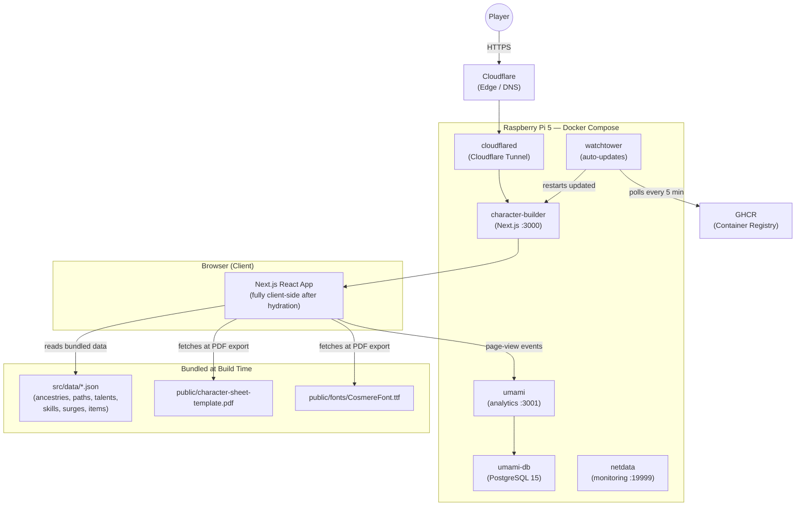
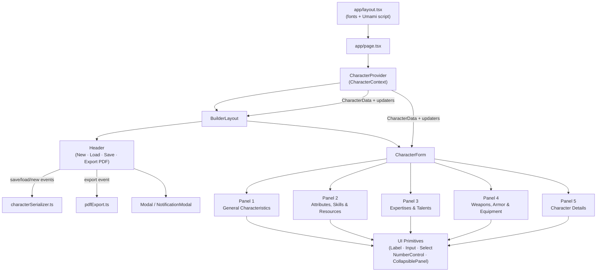
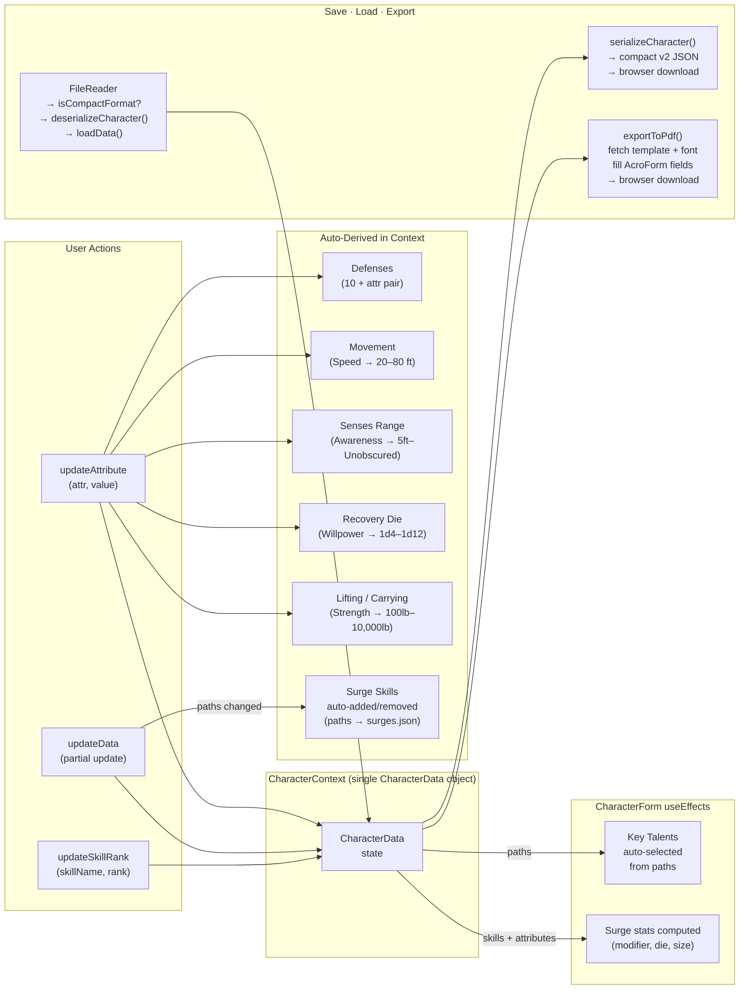
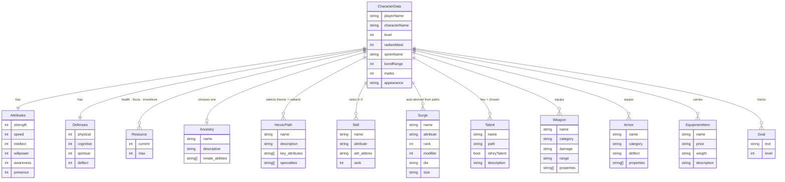

# Cosmere RPG Character Builder — Architecture Diagrams

Source: codebase scan (2026-07-25). No PRD exists yet; these diagrams
describe the *as-built* system.

---

## 1. System Architecture

*How the browser, app, static assets, and deployment infrastructure relate.*

---

## 2. Component Hierarchy

*React component tree showing ownership and data flow.*

---

## 3. State & Data Flow

*How CharacterContext state changes propagate and trigger derived calculations.*

---

## 4. Domain Model

*Key entities in CharacterData and their relationships.*

---

*Changelog*
- 2026-07-25: initial diagrams created from codebase scan
